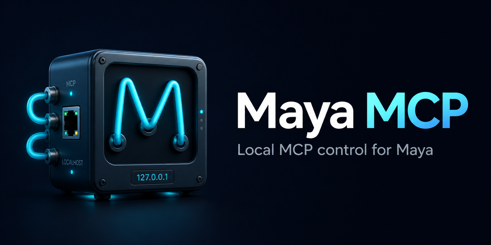

# Maya MCP

[](https://www.python.org/downloads/)
[](https://pypi.org/project/maya-mcp/)
[](https://github.com/GimbalGoats/GG_MayaMCP/releases/latest)
[](https://github.com/GimbalGoats/GG_MayaMCP/actions/workflows/ci.yml)
[](https://github.com/GimbalGoats/GG_MayaMCP/actions/workflows/publish-pypi.yml)
[](https://gimbalgoats.github.io/GG_MayaMCP/)
[](https://github.com/GimbalGoats/GG_MayaMCP/releases/latest)
[](https://opensource.org/licenses/MIT)

[Download Claude Desktop extension (.mcpb)](https://github.com/GimbalGoats/GG_MayaMCP/releases/latest)



Maya MCP is a local Model Context Protocol server for controlling Autodesk Maya through Maya's `commandPort`.

It gives MCP clients a typed tool surface for scene work, nodes, selection, modeling, shading, skinning, animation, curves, scripts, and viewport capture without importing Maya modules in the server process.

This project is unofficial and is not affiliated with or endorsed by Autodesk. Autodesk Maya is a trademark of Autodesk, Inc.

## Why Use It

- runs outside Maya, so the server stays isolated from Maya imports
- talks to Maya over `localhost` only
- exposes 71 typed tools instead of raw API calls
- supports safer scene replacement flows for unsaved changes
- leaves raw code execution disabled unless you opt in

## Claude Desktop Quick Start

For Claude Desktop, use the packaged MCPB extension from
[the latest GitHub Release](https://github.com/GimbalGoats/GG_MayaMCP/releases/latest).

1. Download `maya-mcp-<version>.mcpb` from the release **Assets** section.
2. Install it in Claude Desktop by double-clicking the `.mcpb` file, dragging
   it into Claude Desktop, or using Settings -> Extensions -> Advanced settings
   -> Install Extension.
3. Keep the Maya commandPort setting at `7001` unless you use a different port.
4. Open Maya and run the commandPort setup from the next section.
5. In Claude Desktop, verify with `health_check`, `scene_info`, and
   `nodes_list`.

Claude Desktop uses underscore tool names such as `scene_info`. Other MCP
clients use dotted names such as `scene.info`.

## Quick Start

### 1. Install

```bash
pip install maya-mcp
```

On Windows:

```powershell
py -m pip install maya-mcp
```

From source:

```bash
pip install -e ".[dev]"
```

### 2. Open Maya `commandPort`

Run this in Maya's Script Editor on the Python tab:

```python
import maya.cmds as cmds

try:
    cmds.commandPort(name=":7001", close=True)
except RuntimeError:
    pass

cmds.commandPort(
    name=":7001",
    sourceType="python",
    echoOutput=True,
    noreturn=False,
    bufferSize=16384,
)
```

### 3. Start the server

```bash
maya-mcp
```

Other supported launch styles:

```bash
python -m maya_mcp.server
python src/maya_mcp/server.py
fastmcp run
```

`fastmcp run` works from this repo because it includes `fastmcp.json`.

### 4. Add it to your client

#### Codex CLI / IDE extension

Codex uses `~/.codex/config.toml` for MCP servers. The CLI and IDE extension share that config.

Installed package:

```toml
[mcp_servers.maya]
command = "maya-mcp"
```

Source checkout or Windows-friendly setup:

```toml
[mcp_servers.maya]
command = "py"
args = ["-m", "maya_mcp.server"]
env = { PYTHONPATH = "src" }
```

Use the `PYTHONPATH` line only when running from a source checkout.
Use `python` instead of `py` on platforms that do not provide the Windows launcher.

#### Claude Code

Claude Code project-scoped MCP servers live in `.mcp.json`.
The server key is user-defined; these examples use `maya` consistently.

Installed package:

```json
{
  "mcpServers": {
    "maya": {
      "command": "maya-mcp",
      "args": []
    }
  }
}
```

Source checkout or Windows-friendly setup:

```json
{
  "mcpServers": {
    "maya": {
      "command": "py",
      "args": ["-m", "maya_mcp.server"],
      "env": {
        "PYTHONPATH": "src"
      }
    }
  }
}
```

For Codex CLI and Claude Code on Windows, `py -m maya_mcp.server` is usually more reliable than relying on the `maya-mcp` console script being on the correct `PATH`.

#### Claude Desktop Extension

Maya MCP ships as a Claude Desktop MCPB extension. The extension still runs the
same local stdio server and keeps Maya communication on `localhost`.

User installation, build, verification, and troubleshooting notes live in
[Claude Desktop Extension](docs/usage/claude-desktop-extension.md).

Published GitHub Releases attach the built `.mcpb` package as
`maya-mcp-<version>.mcpb` after the release workflow validates and smoke-tests
the bundle.

The packaging script supports a user-local MCPB CLI install:

```powershell
npm install --prefix "$env:USERPROFILE\.tools\mcpb" @anthropic-ai/mcpb
.\packaging\claude-mcpb\build.ps1
```

#### VS Code

VS Code uses `.vscode/mcp.json` with a `servers` object.

```json
{
  "servers": {
    "maya": {
      "type": "stdio",
      "command": "maya-mcp"
    }
  }
}
```

#### Other MCP clients

Some clients use a generic `mcpServers` object:

```json
{
  "mcpServers": {
    "maya": {
      "command": "maya-mcp",
      "args": []
    }
  }
}
```

### 5. Verify

Call these tools in order:

1. `health.check`
2. `scene.info`
3. `nodes.list`

## Tool Coverage

| Family | Count |
|---|---:|
| `health` | 1 |
| `maya` | 2 |
| `scene` | 9 |
| `nodes` | 7 |
| `attributes` | 2 |
| `selection` | 6 |
| `connections` | 5 |
| `mesh` | 3 |
| `viewport` | 1 |
| `modeling` | 15 |
| `shading` | 3 |
| `skin` | 6 |
| `animation` | 6 |
| `curve` | 2 |
| `script` | 3 |

`script.run` is disabled by default and requires `MAYA_MCP_ENABLE_RAW_EXECUTION=true`.

`scene.new` and `scene.open` still refuse by default when the current scene has unsaved changes. Clients that advertise MCP form elicitation can receive an in-band discard-changes confirmation instead of having to retry with `force=True`.

## Main Docs

- [Docs Home](docs/index.md)
- [Getting Started](docs/usage/getting-started.md)
- [Client Setup](docs/usage/client-setup.md)
- [Claude Desktop Extension](docs/usage/claude-desktop-extension.md)
- [Tool Guide](docs/spec/tools.md)
- [Architecture Overview](docs/spec/overview.md)
- [Transport Specification](docs/spec/transport.md)
- [Security Specification](docs/spec/security.md)
- [Privacy Policy](docs/privacy.md)
- [API Reference](docs/api/reference.md)

Published docs: <https://gimbalgoats.github.io/GG_MayaMCP/>

## Development

This repo uses `py` for Python commands on Windows:

```powershell
py -m ruff check .
py -m ruff format .
py -m mypy src/
py -m pytest
```

If tests import `maya_mcp` from `site-packages` instead of this repo:

```powershell
$env:PYTHONPATH='src'
py -m pytest
```

## Security Notes

- localhost only
- no remote-host support
- no Maya imports in the MCP server process
- no arbitrary code execution by default
- no secrets or raw tracebacks in client-facing errors

## Privacy

Maya MCP runs locally. The project does not operate a hosted service, collect
telemetry, or receive Maya scene data from local use. See
[Privacy Policy](docs/privacy.md).

## License

MIT. See [LICENSE](LICENSE).
